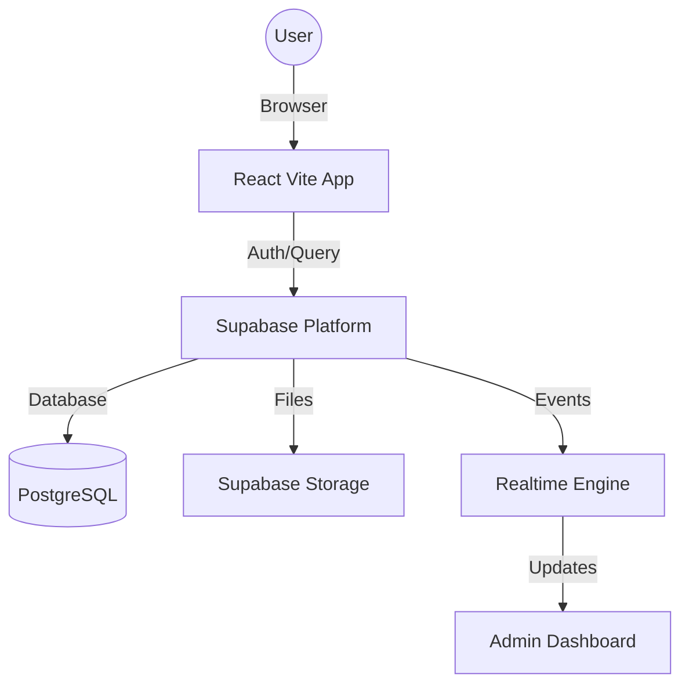

# Project Manifesto: Refresh Breeze

## Core Vision
Refresh Breeze adalah platform manajemen dan shopping yang didesain khusus untuk komunitas idol dan fan, dengan fokus pada pengalaman yang premium, cepat, dan berkarakter. Project ini bukan sekadar CMS, melainkan perpanjangan dari identitas brand "Refresh Breeze".

## Brand Identity: "Kawaii Metal"
Desain Refresh Breeze mengusung tema **Kawaii Metal**. Ini berarti perpaduan antara elemen yang lucu/cantik (*kawaii*) dengan estetika yang tajam, industrial, dan premium (*metal*).
- **Kawaii**: Penggunaan warna pastel yang cerah (pink, teal), ikon yang ramah, dan interaksi yang halus.
- **Metal**: Penggunaan Glassmorphism, border tajam, background gelap yang dalam, dan efek neon.

## Core Values
1. **Premium Aesthetics**: Setiap halaman harus membuat user merasa menggunakan aplikasi kelas atas. Tidak boleh terlihat seperti template generik.
2. **Speed & Reliability**: Interaksi harus instan. Penggunaan Supabase Realtime dan optimasi gambar sangat kritikal.
3. **Mobile First**: Karena basis user mayoritas menggunakan smartphone, tampilan mobile adalah prioritas utama tanpa mengorbankan kualitas desktop.
4. **Emotional Connection**: Fitur seperti Digital Receipt dan IG Story Sharing bertujuan untuk meningkatkan koneksi emosional antara fan dan brand.

## Key Features
- **Smart Shopping**: Sistem checkout yang efisien untuk Cheki dan Merchandise.
- **Digital Collectibles**: Digital Receipt yang bisa dipersonalisasi dan dikoleksi.
- **Admin Command Center**: Dashboard manajemen event, member, dan order yang realtime.
- **Seamless Integration**: Integrasi penuh dengan Supabase untuk data dan storage.


# Brand Identity Guide

## Color Palette (HSL Focused)
Gunakan format HSL untuk fleksibilitas opacity dan glassmorphism.

| Role | HSL / Value | Usage |
| :--- | :--- | :--- |
| **Primary** | `hsl(330, 100%, 70%)` | Accent color, buttons, highlights (Pink Kawaii). |
| **Secondary** | `hsl(180, 100%, 45%)` | Secondary accents, success states (Teal Breeze). |
| **Background** | `hsl(240, 10%, 4%)` | Deep dark background (Metal). |
| **Surface** | `hsla(240, 10%, 10%, 0.7)` | Glassmorphism base layer. |
| **Border** | `hsla(0, 0%, 100%, 0.1)` | Subtle borders for glass effect. |

## Typography
- **Primary Font**: `Outfit` atau `Inter` (Sans-serif) untuk kejelasan dan kesan modern.
- **Accent Font**: `Syne` atau `Space Grotesk` (untuk headline yang berkarakter "Metal").
- **Rules**:
    - Headline selalu `font-weight: 700` atau lebih.
    - Body text minimal `14px` di mobile.

## Glassmorphism Rules
Untuk menjaga kesan premium, gunakan aturan berikut:
- `backdrop-filter: blur(12px) saturate(180%)`.
- `background: rgba(255, 255, 255, 0.05)`.
- `border: 1px solid rgba(255, 255, 255, 0.1)`.
- `box-shadow: 0 8px 32px 0 rgba(0, 0, 0, 0.8)`.

## Visual Elements
- **Icons**: Gunakan `Lucide React` dengan stroke thin (1.5px).
- **Gradients**: Gunakan gradient halus, jangan terlalu kontras (e.g., Deep Purple to Black).
- **Animations**: Gunakan `framer-motion` untuk setiap transisi halaman dan hover button.


# AI Vibe Coding Protocol (SOP)

Sebagai AI Coding Assistant, saya wajib mengikuti protokol ini untuk menjaga integritas project RB Remake.

## 1. Pre-Coding Check
Sebelum mengubah kode, saya harus:
- Membaca file `.ai_rules/` yang relevan.
- Mengecek file `.env` dan `package.json` untuk memahami dependensi.
- Memastikan tidak ada *breaking changes* pada sistem database.

## 2. Coding Standards
- **Atomic Edits**: Ubah bagian yang diperlukan saja. Jangan menulis ulang seluruh file jika hanya satu fungsi yang berubah.
- **Consistency**: Gunakan gaya penulisan yang sudah ada (e.g., jika project pakai `const`, jangan ganti ke `function`).
- **No Placeholders**: Jangan pernah menggunakan URL gambar dummy. Gunakan placeholder yang estetik atau generate gambar baru yang relevan.
- **Preserve Comments**: Jangan hapus komentar penting dari developer sebelumnya.

## 3. UI/UX Integrity
- Setiap komponen baru **wajib** memiliki desain Glassmorphism dan Responsive.
- Pastikan interaksi terasa "hidup" dengan micro-animations.
- Gunakan utility toast yang sudah ada (`src/lib/toast.jsx`) untuk notifikasi.

## 4. Reporting
Setelah melakukan perubahan, saya harus memberikan ringkasan:
- Apa yang diubah?
- Mengapa diubah (Rationale)?
- Apa efeknya terhadap komponen lain?

## 5. Restrictions (Larangan)
- **DILARANG** mengubah konfigurasi CSS global (`index.css`) tanpa instruksi eksplisit.
- **DILARANG** menghapus file `.ai_rules/` ini.
- **DILARANG** melakukan push ke branch `main` jika ada error linting.


# Core Tech Stack Inventory

## Frontend
- **Framework**: React 18+
- **Build Tool**: Vite
- **Styling**: Vanilla CSS (CSS Modules preferred for isolation) / Tailwind (jika diminta).
- **Icons**: `lucide-react`
- **Animations**: `framer-motion`
- **State Management**: React Hooks (Context API jika diperlukan).
- **HTTP Client**: Supabase JS Client

## Backend & Services
- **Backend-as-a-Service**: Supabase
- **Database**: PostgreSQL (Supabase DB)
- **Authentication**: Supabase Auth
- **Storage**: Supabase Storage (Buckets: `receipts`, `members`, `products`)
- **Realtime**: Supabase Realtime (untuk monitoring order).

## Image Processing
- **Format**: WebP (Mandatory for all uploads).
- **Compression**: Client-side compression menggunakan `canvas` atau library terkait sebelum upload.

## Deployment
- **Platform**: Vercel
- **Environment**: Node.js 18+


# System Architecture Map

## Overview
Refresh Breeze menggunakan arsitektur **Decoupled Client-Server** dengan Supabase sebagai orkestrator backend-nya.

## Data Flow Diagram (Conceptual)


## Key Modules
1. **Public Shop**: Menangani navigasi produk, keranjang belanja, dan proses checkout.
2. **Checkout Engine**: Logika validasi data, upload bukti pembayaran, dan integrasi database.
3. **Receipt Generator**: Komponen khusus untuk merender struk digital secara dinamis.
4. **Admin Dashboard**: Modul terproteksi untuk mengelola inventory, melihat order, dan statistik.

## Communication Patterns
- **Queries**: Langsung dari Client ke Supabase menggunakan `supabase-js`.
- **Realtime**: Dashboard melakukan `subscribe` ke tabel `orders` untuk update instan.
- **Storage**: Upload gambar dilakukan dari client dengan token akses yang valid.


# Directory Structure Rules

## Root Directory
- `/frontend`: Seluruh kode aplikasi React.
- `/backend` / `/api`: Serverless functions (Vercel/Supabase).
- `/database`: Migration files dan script SQL.
- `/.ai_rules`: Dokumentasi konteks untuk AI (folder ini).

## Frontend Structure (`/frontend/src`)
- `/components`: Komponen UI yang reusable.
    - `/common`: Button, Input, Modal, Toast (UI Dasar).
    - `/shop`: Komponen spesifik untuk alur belanja (Cart, Checkout, Receipt).
    - `/admin`: Komponen khusus dashboard management.
- `/pages`: Halaman utama aplikasi (Shop, Admin, Home).
- `/lib`: Inisialisasi library pihak ketiga (supabaseClient.js, toast.js).
- `/hooks`: Custom React hooks untuk logic (useCart, useAuth).
- `/assets`: Gambar, icon, dan file statis.
- `/styles`: Global CSS dan tema.

## Rules for New Files
1. **Components**: Gunakan PascalCase (e.g., `DigitalReceipt.jsx`). Setiap komponen harus punya file `.css` sendiri jika logic stylingnya kompleks.
2. **Utilities**: Gunakan camelCase (e.g., `imageCompression.js`).
3. **Styles**: Preferensi CSS Modules untuk menghindari konflik nama class.
4. **Icons**: Selalu impor dari `lucide-react`.


# Global Styling Tokens

## Color Variables (CSS)
Simpan variabel ini di `:root` dalam `index.css` atau `variables.css`.

```css
:root {
  /* Brand Colors */
  --color-primary: hsl(330, 100%, 70%); /* Pink Kawaii */
  --color-secondary: hsl(180, 100%, 45%); /* Teal Breeze */
  --color-accent: hsl(280, 80%, 60%); /* Purple Metal */

  /* Neutral Colors */
  --bg-deep: hsl(240, 10%, 4%);
  --bg-surface: hsla(240, 10%, 12%, 0.6);
  --text-main: hsl(0, 0%, 95%);
  --text-dim: hsl(0, 0%, 70%);

  /* Border & Glass */
  --glass-border: hsla(0, 0%, 100%, 0.1);
  --glass-reflection: hsla(0, 0%, 100%, 0.05);

  /* Spacing */
  --space-xs: 0.25rem;
  --space-sm: 0.5rem;
  --space-md: 1rem;
  --space-lg: 2rem;
  --space-xl: 4rem;

  /* Shadows */
  --shadow-neon-pink: 0 0 15px hsla(330, 100%, 70%, 0.3);
  --shadow-neon-teal: 0 0 15px hsla(180, 100%, 45%, 0.3);
}
```

## Typography Rules
- **Headline**: `font-family: 'Space Grotesk', sans-serif; text-transform: uppercase; letter-spacing: 0.05em;`
- **Body**: `font-family: 'Inter', sans-serif; line-height: 1.6;`

## UI Constants
- **Border Radius**: `12px` (Standard), `24px` (Buttons), `50%` (Circular).
- **Default Transition**: `all 0.3s cubic-bezier(0.4, 0, 0.2, 1)`.
