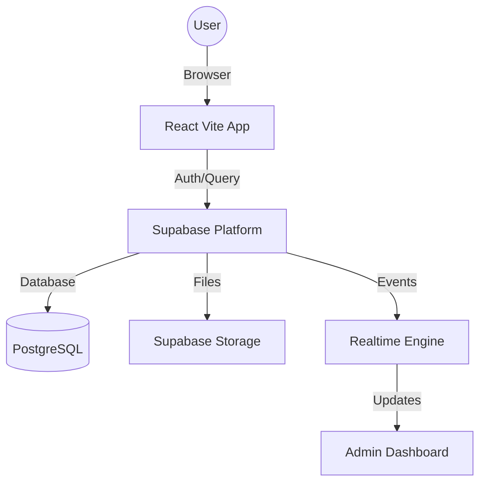

# System Architecture Map

## Overview
Refresh Breeze menggunakan arsitektur **Decoupled Client-Server** dengan Supabase sebagai orkestrator backend-nya.

## Data Flow Diagram (Conceptual)

## Key Modules
1. **Public Shop**: Menangani navigasi produk, keranjang belanja, dan proses checkout.
2. **Checkout Engine**: Logika validasi data, upload bukti pembayaran, dan integrasi database.
3. **Receipt Generator**: Komponen khusus untuk merender struk digital secara dinamis.
4. **Admin Dashboard**: Modul terproteksi untuk mengelola inventory, melihat order, dan statistik.

## Communication Patterns
- **Queries**: Langsung dari Client ke Supabase menggunakan `supabase-js`.
- **Realtime**: Dashboard melakukan `subscribe` ke tabel `orders` untuk update instan.
- **Storage**: Upload gambar dilakukan dari client dengan token akses yang valid.
